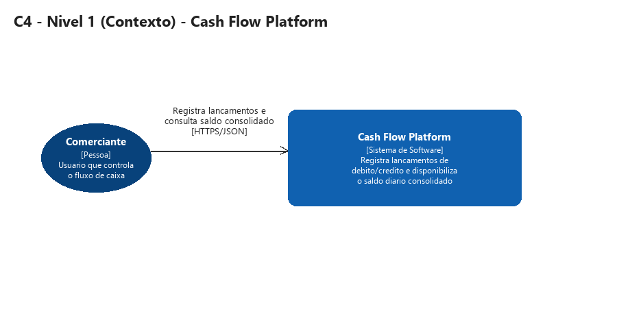
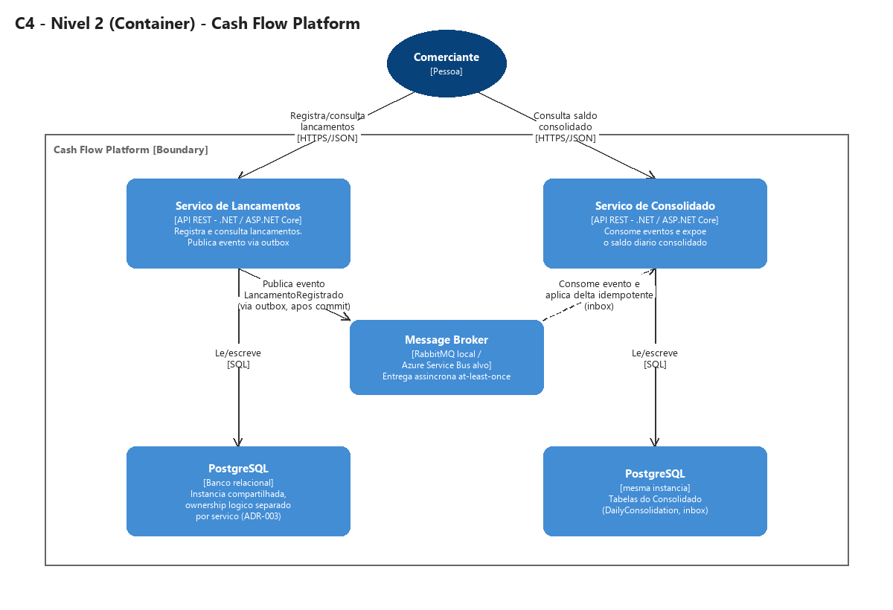
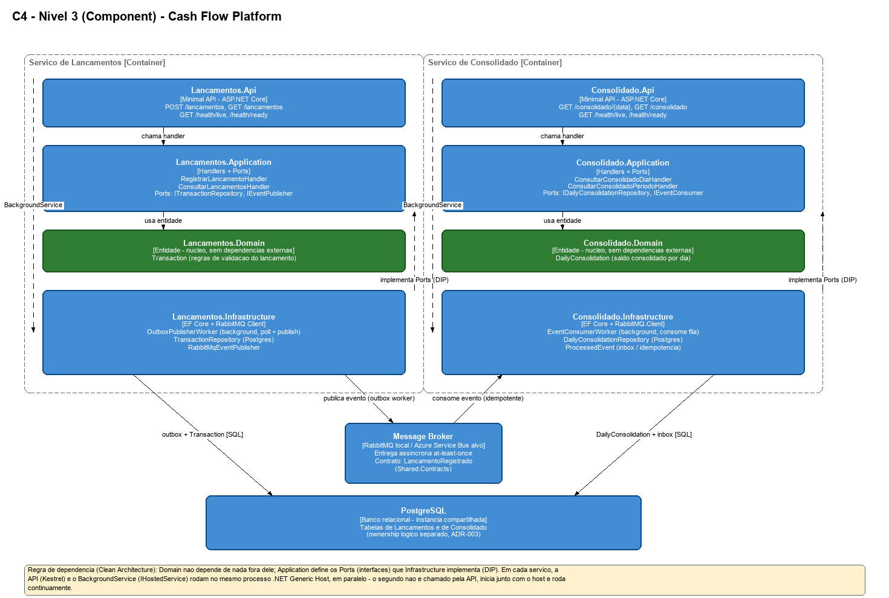
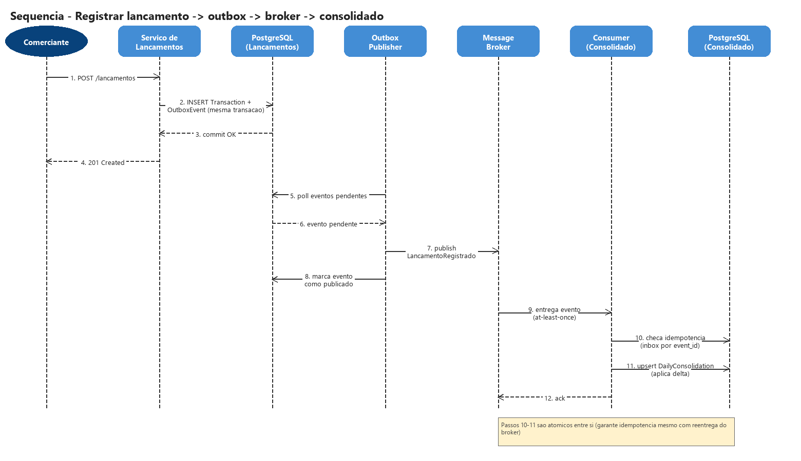

# Diagramas

Cada diagrama é entregue em dois formatos: `.png` (visualização direta, embutida abaixo) e `.xml` (fonte editável, importável no [draw.io](https://app.diagrams.net/), para reaproveitamento futuro).

- **C4 - Nível de Contexto** (`c4-context.png` / `.xml`)

  

- **C4 - Nível de Container** (`c4-container.png` / `.xml`)

  

- **C4 - Nível de Componente** — estrutura interna dos dois serviços (Api/Application/Domain/Infrastructure, Clean Architecture) lado a lado (`c4-component.png` / `.xml`)

  

- **Sequência - Registrar Lançamento** — fluxo registrar lançamento → outbox → broker → atualização do consolidado (`sequence-registrar-lancamento.png` / `.xml`)

  

- **Arquitetura de Transição** — implementação local (Docker Compose) → arquitetura alvo (Azure), peça a peça (`transition-architecture.png` / `.xml`)

  

> Status: PNG gerado a partir da mesma fonte de dados do XML (script utilitário, não versionado — os artefatos finais são o PNG e o XML), garantindo consistência entre os dois formatos. XML testado como importável no draw.io.
