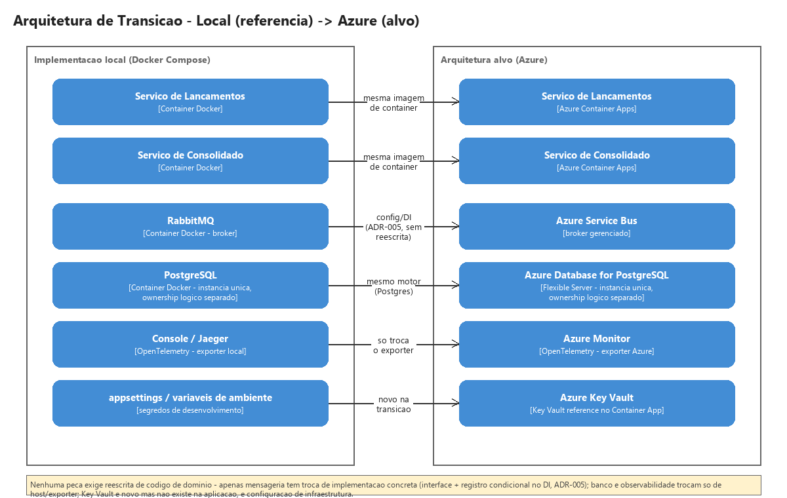

# Arquitetura de Transição

> Diagrama fonte: [`diagrams/transition-architecture.xml`](diagrams/transition-architecture.xml) (importável no draw.io). Mapeia cada peça da implementação local (`docker-compose.yml`) para o serviço gerenciado equivalente na arquitetura alvo (`architecture.md`), peça a peça.

> Atende ao diferencial "Desenho da solução da Arquitetura de Transição (se necessária)" e à seção "Observações" do desafio original: "Também são bem vindas descrições sobre o que você gostaria de ter implementado ou evoluções futuras para o sistema proposto." Este documento consolida, num único lugar, decisões que deliberadamente mantivemos simples dentro do orçamento de tempo do desafio (24h) — cada uma com a motivação da escolha atual, o gatilho que justificaria evoluir, e o trade-off aceito enquanto isso não acontece. Não é uma lista de features desejadas soltas: cada linha corresponde a uma decisão real já tomada e documentada (ADR ou issue), com o adiamento explicitado aqui em vez de deixado implícito.

| Evolução | Motivação da decisão atual | Gatilho para evoluir | Trade-off aceito hoje | Referência |
|---|---|---|---|---|
| Instância única de PostgreSQL → instâncias separadas por serviço (Lançamentos / Consolidado) | Reduz complexidade operacional dentro do prazo de 4 dias — um único servidor pra subir, monitorar e fazer backup | Cenário de produção real com requisitos mais rígidos de isolamento e disponibilidade, ou evidência concreta de contenção de recursos sob carga | Sob carga elevada no Consolidado, recursos compartilhados (CPU, I/O, conexões) podem afetar indiretamente o Lançamentos, mesmo com a comunicação entre os serviços sendo 100% assíncrona | ADR-003 |
| Sem cache / réplica de leitura / particionamento no Consolidado | O SLA de 50 req/s é atendido por PostgreSQL simples com índice em `Data`, dada a baixa cardinalidade do consolidado diário — adicionar essas estratégias sem evidência seria complexidade prematura | Teste de carga (issue #20) mostrando que o índice simples não sustenta o SLA na prática | Risco de precisar adicionar uma camada de infraestrutura nova sob pressão, já em produção, em vez de planejada com calma | ADR-003, issue #20 |
| Redundância / failover de infraestrutura (PostgreSQL HA, cluster RabbitMQ) | Instância única de cada é suficiente para demonstrar a arquitetura dentro do escopo do desafio; alta disponibilidade de infraestrutura é um problema ortogonal ao que o desafio pede para resolver | Deploy real em produção com SLA de uptime formal, fora do contexto de desafio técnico | Postgres e RabbitMQ são pontos únicos de falha (SPOF) nesta fase — uma queda da instância derruba ambos os serviços, apesar de eles serem desacoplados entre si | ADR-003 (a formalizar) |
| RabbitMQ local (Docker Compose) → Azure Service Bus gerenciado | Implementação de referência 100% local, sem custo e sem dependência de conta Azure para rodar/avaliar o desafio | Deploy real no Azure (arquitetura-alvo já documentada) | Nenhum — a troca já é suportada por design (interfaces + registro condicional no DI, ADR-005/NFR06), é só configuração | ADR-004, ADR-005 |
| Autenticação/autorização no consumo dos serviços (Lançamentos e Consolidado, Lançamentos priorizado por ser o caminho de escrita) | Fora do compromisso obrigatório do desafio — item explicitamente listado como diferencial | Admissão incremental do diferencial, conforme ritmo real comprovar que cabe no orçamento de 24h (ver `poAgent.md`) | Os dois serviços hoje são publicamente acessíveis sem controle de acesso — `POST /lancamentos` inclusive | Issue #17 (diferencial) |
| Observabilidade além do console/Aspire Dashboard local (dashboards, alertas proativos) | OpenTelemetry já adotado desde o início (vendor-neutral) garante que os dados existem; a parte de "vitrine" (dashboards, alertas) é diferencial | Admissão incremental do diferencial, mesmo critério acima | Hoje é possível rastrear localmente, mas não há alerta proativo de degradação | NFR05, issue #21 (diferencial) |
| 2 nós assimétricos (Nível 1 do `docs/cost-estimate.md`) → arquitetura-alvo com compute isolado por serviço (Nível 2, Azure Container Apps) | Fecha NFR01 também na infraestrutura por um custo marginal (+25% sobre uma VPS única, ≈R$ 25,60/mês): Consolidado isolado em nó próprio (Nó B), sem levar Postgres/RabbitMQ/Lançamentos (Nó A) junto numa queda de host | Deploy real em produção com SLA de uptime contratual para o Lançamentos, ou medição real mostrando contenção de CPU/I/O no Nó A sob carga simultânea de Lançamentos e sua própria infra de banco/broker | O Nó A (Postgres + RabbitMQ + Lançamentos) continua sendo SPOF — uma queda dele derruba banco, broker e o próprio Lançamentos juntos. É o mesmo risco de recurso compartilhado já aceito na linha acima (ADR-003), só que agora isolado do Consolidado: o NFR01 (Lançamentos sobreviver à queda do Consolidado) já está coberto também na infraestrutura, não só no desenho lógico | ADR-003 (extensão), issue #25 |

## Fora do roadmap por não ter base em requisito

Itens considerados e descartados por não corresponderem a nenhum requisito documentado (RF/NFR) — registrados aqui só para não serem propostos de novo sem contexto:

- **Projeção de saldo futuro** no Consolidado (além da posição consolidada do dia) — chegou a entrar no escopo inicial da issue #13 por engano; RF04 e `domain-mapping.md` só pedem soma consolidada por data/período. Cortado em 2026-09-07.
